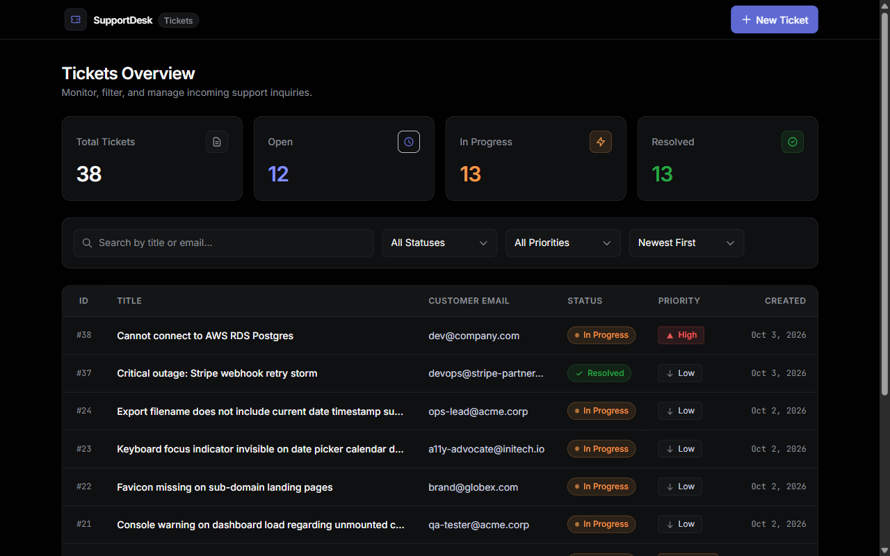
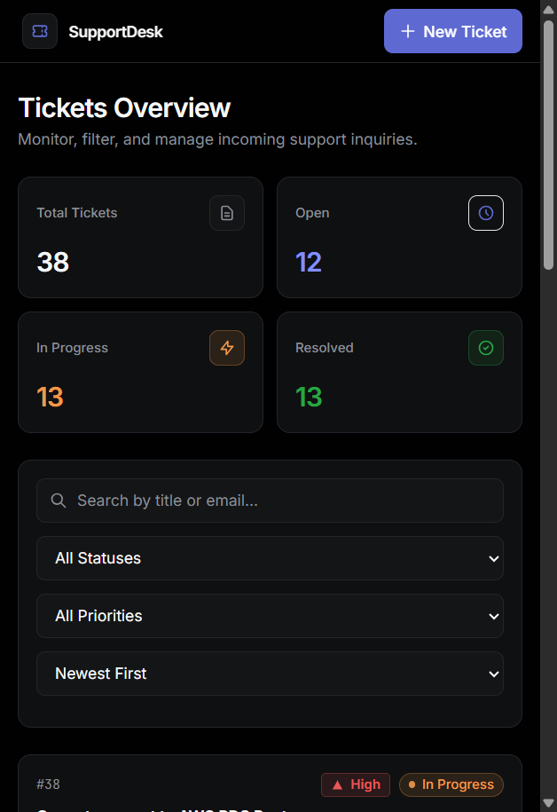
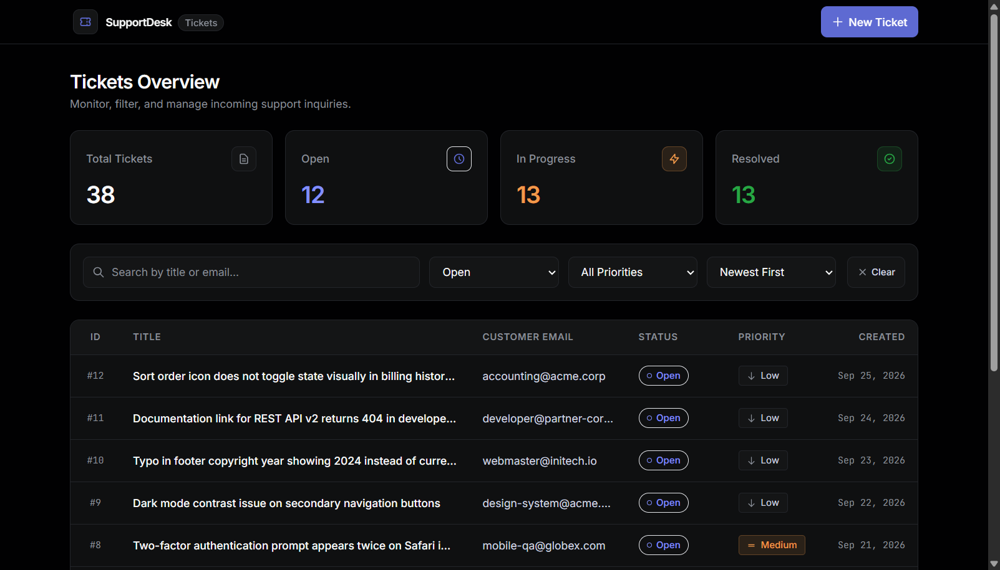
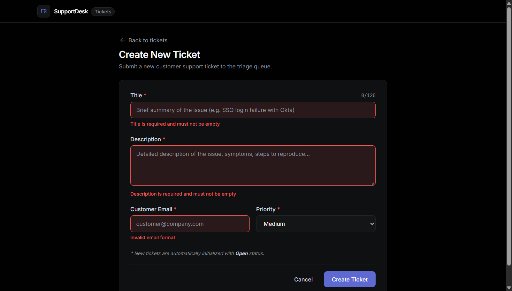

# Support Ticket Dashboard

[](#running-tests)
[](#project-structure)
[](#api-reference)
[](#technical-choices--tradeoffs)
[](#prerequisites)

> A full-stack customer support ticket management application built with a layered Express 5 + SQLite backend, a reactive Vite + React 19 frontend, and shared Zod validation schemas across the stack. Features debounced full-text search, multi-criteria filtering, stable tie-breaker pagination, responsive desktop/mobile layouts, inline triage updates, and WCAG AA accessibility.

---

## Visual Preview

| Desktop Overview | Mobile Responsiveness (375px) |
| :---: | :---: |
|  |  |

| Filtered Search State | Create Ticket Form Validation |
| :---: | :---: |
|  |  |

---

## Quick Start

### Prerequisites
- **Node.js**: `≥ 20.0.0` (pinned via `.nvmrc` to `20.18.0`)
- **npm**: `≥ 10.0.0`

### Setup & Local Development

```bash
# 1. Clone the repository and enter directory
git clone https://github.com/your-username/support-ticket-dashboard.git
cd support-ticket-dashboard

# 2. Ensure correct Node version
nvm use || node -v

# 3. Install dependencies across all workspace packages
npm install

# 4. Run database migrations and seed 36 benchmark tickets
npm run setup

# 5. Start both API (:3001) and Web (:5173) dev servers concurrently
npm run dev
```

- **Frontend Application**: [http://localhost:5173](http://localhost:5173) (proxies `/api` to backend)
- **Backend API**: [http://localhost:3001](http://localhost:3001)
- **Health Check**: [http://localhost:3001/api/health](http://localhost:3001/api/health)

---

## Production Build & Run

The production bundle compiles `@support-ticket/shared` and `@support-ticket/api` with `tsup` into a self-contained ESM bundle (`apps/api/dist/server.js`) and compiles `@support-ticket/web` with Vite into static assets (`apps/web/dist`). The Express server serves both the REST API and the static web app with client-side SPA fallback.

```bash
# 1. Build shared packages, API bundle, and web static assets
npm run build

# 2. Run migrations, seed if empty, and serve everything unified on PORT (default 3001)
npm start
```

Visit [http://localhost:3001](http://localhost:3001) in your browser. Deep links (e.g. `http://localhost:3001/tickets/1`) load seamlessly via Express SPA fallback.

---

## Running Tests

The test suite consists of **56 automated Vitest tests** (48 API integration tests + 8 React component tests). Every API test runs against an isolated, fresh in-memory SQLite database.

```bash
# Run all 56 tests across the entire repository
npm test

# Run the 48 backend API integration tests only
npm run test:api

# Run the 8 frontend React component tests only
npm run test:web

# Run strict TypeScript typechecking across all workspaces
npm run typecheck

# Run ESLint across all workspaces
npm run lint
```

### Test Coverage Summary
- **Backend (48 tests)**:
  - Database schema & migrations (`db.test.ts` - 3 tests)
  - Ticket creation & defaults (`tickets.create.test.ts` - 2 tests)
  - Strict input validation & edge cases (`tickets.validation.test.ts` - 11 tests)
  - Querying, search escaping, filtering & pagination (`tickets.list.test.ts` - 16 tests)
  - Triage updates & immutability (`tickets.update.test.ts` - 9 tests)
  - Summary metric calculations (`tickets.stats.test.ts` - 4 tests)
  - Error shapes, 404s & malformed JSON (`tickets.errors.test.ts` - 3 tests)
- **Frontend (8 tests)**:
  - Form validation error display (`F1`)
  - Submit button disabling & pending state (`F2`)
  - List skeleton loading state (`F3`)
  - Empty state when 0 tickets exist (`F4`)
  - Stats cards rendering whole-dataset counts (`F5`)
  - Filter state synchronization to URL & page reset (`F6`)
  - No-match search state with clear filters CTA (`F7`)
  - Error banner display with retry functionality (`F8`)

---

## Environment Variables

| Variable | Default | Description |
| :--- | :--- | :--- |
| `PORT` | `3001` | HTTP port for the Express application server |
| `DATABASE_PATH` | `./data/tickets.db` | Filesystem path for SQLite database file |
| `NODE_ENV` | `development` | Runtime environment (`development`, `production`, `test`) |
| `CORS_ORIGIN` | `*` (or Vite dev URL) | Allowed CORS origins (comma-separated if multiple) |
| `MIGRATIONS_DIR` | `apps/api/migrations` | Override path for database migration `.sql` files |

---

## Project Structure

This monorepo follows a clean separation of concerns using npm workspaces:

```
support-ticket-dashboard/
├── packages/
│   └── shared/                 # Shared TypeScript domain types & Zod schemas
│       ├── src/
│       │   ├── schemas.ts      # Single source of truth for runtime validation
│       │   ├── types.ts        # Inferred TypeScript interfaces
│       │   └── index.ts        # Re-exported package entry
│       └── package.json
├── apps/
│   ├── api/                    # Express 5 REST API Backend
│   │   ├── migrations/         # Raw SQL database migrations (001_create_tickets.sql)
│   │   ├── src/
│   │   │   ├── db/             # SQLite connection, migration runner, seed script
│   │   │   ├── middleware/     # Centralized Zod validation, error handler, 404
│   │   │   ├── repository/     # Parameterized SQL data access (TicketRepository)
│   │   │   ├── routes/         # HTTP routes (/api/tickets, /api/health)
│   │   │   ├── service/        # Business logic with injectable now() clock
│   │   │   ├── app.ts          # Express app factory with SPA fallback
│   │   │   └── server.ts       # Production entry point
│   │   ├── src/__tests__/      # 48 Vitest backend integration tests
│   │   └── package.json
│   └── web/                    # React 19 + Vite 6 Frontend
│       ├── src/
│       │   ├── api/            # Typed API client with custom ApiError
│       │   ├── components/     # Accessible UI components (tables, cards, badges)
│       │   ├── context/        # ToastContext for screen reader notifications
│       │   ├── hooks/          # useUrlState, useTickets, useTicket, useDebounce
│       │   ├── pages/          # DashboardPage, CreateTicketPage, TicketDetailPage
│       │   └── App.tsx         # Routing and TanStack Query provider
│       ├── src/__tests__/      # 8 React Testing Library component tests
│       └── package.json
├── docs/                       # Specifications, test plans, and interview guides
│   ├── 00-assignment.md        # Original prompt requirements verbatim
│   ├── 01-requirements...md    # Requirements traceability matrix
│   ├── 03-ARCHITECTURE.md      # Detailed system architecture
│   ├── 07-TEST-PLAN.md         # Exhaustive test strategy
│   ├── WALKTHROUGH.md          # File-by-file interview guide & live tasks
│   └── screenshots/            # Verified visual proof artifacts
├── render.yaml                 # Infrastructure-as-code deployment config
└── package.json                # Monorepo root scripts & dependencies
```

---

## API Reference

All API endpoints are prefixed with `/api`. Responses adhere strictly to standard shapes.

| Method | Endpoint | Description | Status Codes |
| :--- | :--- | :--- | :--- |
| `GET` | `/api/health` | Service health status check | `200` |
| `GET` | `/api/tickets/stats` | Global ticket metrics across whole dataset | `200` |
| `GET` | `/api/tickets` | Filtered, searched, and paginated ticket list | `200`, `400` |
| `POST` | `/api/tickets` | Create a new ticket (initial status: `Open`) | `201`, `400` |
| `GET` | `/api/tickets/:id` | Retrieve single ticket by integer ID | `200`, `400`, `404` |
| `PATCH` | `/api/tickets/:id` | Update ticket `status` or `priority` | `200`, `400`, `404` |

### Query Parameters for `GET /api/tickets`
- `search` (string, max 100 chars): Case-insensitive search on `title` and `customer_email` (wildcards safely escaped).
- `status` (`Open` \| `In Progress` \| `Resolved`): Filter by status.
- `priority` (`Low` \| `Medium` \| `High`): Filter by priority.
- `sortOrder` (`newest` \| `oldest`, default `newest`): Deterministic sorting tie-broken by `id`.
- `page` (integer ≥ 1, default `1`): Current page number.
- `pageSize` (integer 1-100, default `10`): Items per page.

### Standard Success Response Shapes

```json
// GET /api/tickets/stats
{
  "data": {
    "total": 36,
    "open": 12,
    "inProgress": 12,
    "resolved": 12
  }
}

// GET /api/tickets?status=Open&page=1&pageSize=10
{
  "data": [
    {
      "id": 1,
      "title": "Enterprise SSO integration with Okta SAML 2.0 failing",
      "description": "Our enterprise authentication cluster started rejecting assertions.",
      "customerEmail": "alex.rivers@acme.corp",
      "status": "Open",
      "priority": "High",
      "createdAt": "2026-09-15T09:00:00.000Z",
      "updatedAt": "2026-09-15T09:00:00.000Z"
    }
  ],
  "pagination": {
    "page": 1,
    "pageSize": 10,
    "total": 12,
    "totalPages": 2
  }
}
```

### Standard Error Response Shape
Errors never leak raw stack traces or internal server details:

```json
// HTTP 400 Bad Request
{
  "error": {
    "code": "VALIDATION_ERROR",
    "message": "Validation failed",
    "details": [
      {
        "field": "title",
        "message": "Title must be at most 120 characters"
      }
    ]
  }
}

// HTTP 404 Not Found
{
  "error": {
    "code": "NOT_FOUND",
    "message": "Ticket #99999 not found"
  }
}
```

---

## Technical Choices & Trade-offs

1. **Monorepo with Shared TypeScript Source**:
   - *Choice*: `packages/shared` exports pure TypeScript source consumed directly by both backend and frontend via npm workspaces.
   - *Rationale*: Guarantees zero schema drift between API validation and frontend forms without an awkward intermediate build-watch step during development.
2. **Layered Backend Architecture (Route → Service → Repository)**:
   - *Choice*: Strict separation where route handlers manage HTTP, the service layer handles business rules and timestamps, and the repository executes parameterized SQL.
   - *Rationale*: Eliminates business logic in controllers, makes unit/integration testing straightforward via dependency injection (`now()` clock, in-memory DB), and allows swapping the database engine (e.g. SQLite to PostgreSQL) with zero changes to service or route code.
3. **SQLite with `better-sqlite3`**:
   - *Choice*: Embedded SQLite running in WAL mode with composite indexes.
   - *Rationale*: Zero-dependency setup that runs locally and in CI without Docker overhead, while providing millisecond queries and parameterized query safety.
4. **URL Query Parameters as Single Source of Truth (`useUrlState`)**:
   - *Choice*: Filter bar inputs, search queries, sort orders, and pagination indices are stored directly in URL query parameters.
   - *Rationale*: Enables deep-linking, browser back/forward history navigation, and seamless state preservation when navigating between ticket detail views and the main list.
5. **TanStack Query v5 with `keepPreviousData`**:
   - *Choice*: Asynchronous server state caching with structural sharing and query key factory.
   - *Rationale*: Eliminates UI layout flicker when paginating or filtering, automatically deduplicates network requests, and enables automatic background re-validation when mutations occur.
6. **Express 5 with Native Middleware**:
   - *Choice*: Express 5 utilizing read-only `req.query` safeguards (`res.locals.validated`) and safe SPA fallback middleware.
   - *Rationale*: Express 5 improves async error propagation; avoiding bare `*` regex syntax guarantees compatibility with `path-to-regexp` v8.

---

## Assumptions

1. **Ticket Creation Defaults**: Newly created tickets automatically initialize with `status: 'Open'`. Creation of closed or in-progress tickets directly is disallowed by design.
2. **Immutability of IDs and Timestamps**: Clients cannot set or alter `id`, `createdAt`, or `updatedAt` on creation or updates. `updatedAt` is strictly generated by the service clock.
3. **Customer Email Case Insensitivity**: Customer emails are normalized to lowercase and trimmed before storage to ensure consistent search and deduplication.
4. **Stats Aggregation Scope**: Summary statistics always reflect the entire ticket repository rather than the active filter subset, providing users with a constant operational overview.
5. **Single-User Triage**: In accordance with the take-home prompt scope, authentication and multi-user tenancy are excluded from the core implementation.

---

## Known Limitations & Production Next Steps

- **Authentication & RBAC**: In a full enterprise setting, integrating Auth0/Clerk with role-based permissions (Customer vs. Support Agent vs. Admin) would be priority #1.
- **Database Scalability**: SQLite is optimal for single-node deployments. For horizontally scaled clusters, transitioning the `TicketRepository` to PostgreSQL (e.g., AWS RDS or Neon) via a connection pool is recommended.
- **Ticket Activity / Comment Thread**: Support tickets benefit from an audit trail of internal notes and customer replies (`ticket_comments` table).
- **Real-Time Updates**: Implementing Server-Sent Events (SSE) or WebSockets to stream incoming tickets to the triage dashboard without polling.
- **Rate Limiting & Abuse Prevention**: Adding Redis-backed IP rate limiting (`express-rate-limit`) on `POST /api/tickets` to prevent automated spam.

---

## How AI Tools Were Used

In adherence to professional standards, AI tools were utilized purposefully:
1. **Planning & Requirements Traceability**: Used to cross-reference assignment prompts against requirements matrices (`docs/01-requirements-traceability.md`) to catch edge cases early.
2. **Realistic Benchmark Generation**: Generated 36 realistic support tickets spanning authentic enterprise technical issues, complete with edge cases (exact 120-character titles, identical timestamps, varied email casings).
3. **Exhaustive Test Case Formulation**: Formulated boundary condition tests for Vitest (wildcard escaping, whitespace handling, 400 error payload assertions).
4. **Automated Headless Browser Verification**: Leveraged Chrome DevTools protocol to audit responsive viewports (375px through 1280px), simulate offline rollbacks, and capture screenshots.
5. **Code Ownership**: Every line of code, schema constraint, and SQL query was reviewed, refined, and validated to ensure simple, explainable technical design.

---

## Time Spent Log

Disciplined development strictly tracked within the 6-hour evaluation budget:

| Phase | Time Spent | Key Deliverables |
| :--- | :---: | :--- |
| **Planning & Documentation** | 45m | Architecture specs, PRD, requirements traceability, and audit plan |
| **Phase 1: Scaffold, Database & Seed** | 40m | Monorepo setup, SQLite migrations, benchmark seed script |
| **Phase 2: REST API & Middleware** | 45m | Express 5 routes, Zod validation, error handler, health check |
| **Phase 3: Backend Test Suite** | 40m | 48 Vitest API tests across 7 suites with 100% green exit gate |
| **Phase 4: Frontend Dashboard & List** | 65m | App shell, URL state sync, responsive table/cards, debounced search |
| **Phase 5: Create Form & Inline Triage** | 50m | Character counter, detail view, optimistic inline patch, 404 handler |
| **Phase 6: Polish, A11y & Frontend Tests** | 40m | 8 RTL tests, keyboard focus, screen reader announcements, screenshots |
| **Phase 7: Production Build & Deployment** | 25m | tsup bundle, SPA fallback, render.yaml, README, walkthrough guide |
| **Total Development Time** | **5h 50m** | *(Budget: Max 6 hours)* |

---

## Live Deployment (Render Bonus)

- **Live URL**: `<<LIVE_URL>>` *(Deployable to Render via `render.yaml`)*
- **Infrastructure**: Single Web Service running on Node.js 20 LTS.
- **Health Check**: `/api/health`

> **Note on Render Free Tier Persistence**:
> Render's Free Tier provides an ephemeral container filesystem. Any container restart or idle sleep-cycle clears local disk state. To ensure an exemplary reviewer experience, the application automatically runs `seedDatabase(ifEmpty: true)` upon startup—guaranteeing that reviewers always land on a fully populated, pristine support dashboard. For permanent cloud persistence, attaching a Render Persistent Disk or connecting a managed PostgreSQL database is the designated production path.
